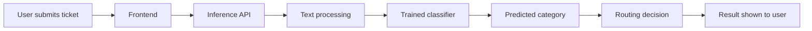

<div align="center">

# RouteIQ
### Multilingual Support Ticket Classification & Intelligent Routing

**TensorForge 2.0 · Phase 2 · MVP**

*A machine-learning-powered workflow for turning incoming support requests into actionable routing decisions.*

[Live Deployment](https://tensorforge2-mvp-production-4468.up.railway.app) · [Source Repository](https://github.com/ahsanahamed02/TensorForge2-MVP)

</div>

---

## Executive overview

Support requests arrive in different languages, with inconsistent wording and varying levels of detail. Manual triage can slow response times and introduce inconsistent categorization. **RouteIQ** explores an automated approach: process an incoming ticket, predict a support category, and help route it to an appropriate destination.

The project is presented as a deployable MVP, with separate components for its interface, inference service, model code, and tests. This repository is the technical companion to the TensorForge 2.0 Phase 2 submission.

> **Engineering principle:** A convincing ML system is not only a prediction. It is a reproducible path from input data to evaluation, an understandable API contract, and an observable deployment.

## System at a glance



*Conceptual workflow. Refer to the API implementation for exact request fields, endpoints, and routing rules.*

## Capabilities

- **Ticket classification:** Predict a category for an incoming support request.
- **Multilingual handling:** Designed to accommodate requests in more than one language; supported languages and measured per-language performance should be documented from evaluation outputs.
- **Routing workflow:** Connect classification output to a downstream support-routing decision.
- **API-backed inference:** Keep inference logic separate from the user-facing interface.
- **Web-based demonstration:** Provide an accessible interface for showcasing the workflow.

## Repository map

| Location | Purpose |
|---|---|
| `api/` | API application and inference integration |
| `frontend/` | User interface and demonstration |
| `model/` | Model-related code and artifacts |
| `tests/` | Validation and regression tests |
| `Dockerfile` | Container build configuration |
| `requirements.txt` | Python dependency definitions |
| `.gitignore` | Local/generated/secret file exclusions |

*These paths are visible in the shared repository screenshot. Inspect each directory for the authoritative implementation.*

## Machine-learning methodology

The evaluation report should establish the full chain of evidence:

1. **Data definition:** Ticket source, label taxonomy, language coverage, class balance, and train/validation split.
2. **Preprocessing:** Text normalization and language-specific handling, with no information leakage between splits.
3. **Model development:** Baseline, candidate model(s), training configuration, and selection rationale.
4. **Validation:** Per-class precision/recall/F1, macro-F1, confusion matrix, and examples of failure cases.
5. **Inference:** Identical preprocessing during training and serving, deterministic label mapping, and explicit error responses.

### Evaluation results

| Measure | Result | Evidence |
|---|---|---|
| Validation accuracy | *Add measured value* | Evaluation report |
| Macro-F1 | *Add measured value* | Evaluation report |
| Per-language performance | *Add measured values* | Language-level test results |
| Inference latency | *Add measured value and test conditions* | Deployment benchmark |

**Why these metrics?** Accuracy alone can hide poor performance on less common categories. Macro-F1 gives each class equal weight and is useful when label frequencies differ. Performance should also be checked across supported languages.

> **Submission integrity:** Replace placeholders only with numbers backed by actual evaluation artifacts. Do not present estimated or training-set results as independent validation.

## API contract

**Hosted base URL:**

```text
https://tensorforge2-mvp-production-4468.up.railway.app
```

The actual route names, HTTP methods, authentication header, and JSON request/response shapes must be taken from the implementation or published OpenAPI specification before adding copy-paste examples here.

For judges, document:

- Inference route and HTTP method
- Required JSON fields and their types
- Successful response schema (category, routing outcome, optional confidence)
- Validation and authentication errors
- Health/status endpoint, if implemented

**Credential handling:** Never put the assigned competition API key, `.env` values, or live secrets in this README, commits, screenshots, or downloadable archives.

## Run locally

The following is a starting point for a Python-based repository. Confirm the application entry point and configuration requirements against the source before running.

```bash
git clone https://github.com/ahsanahamed02/TensorForge2-MVP.git
cd TensorForge2-MVP
python -m venv .venv
```

Activate the environment:

```powershell
# Windows PowerShell
.\.venv\Scripts\Activate.ps1
```

```bash
# Linux / macOS
source .venv/bin/activate
```

Install declared dependencies:

```bash
python -m pip install -r requirements.txt
```

**Next:** Add the verified API start command, frontend start command, and required *non-secret* configuration names after checking the relevant source files. Avoid publishing a guessed command that fails for judges.

## Deployment and reliability

The MVP is linked to a Railway-hosted service. A production-minded review should cover:

- Environment-based configuration and protected credentials
- Input validation and clear failure responses
- Consistent inference artifacts and label mappings
- Startup/health checks and useful application logs
- Container reproducibility and pinned dependencies where appropriate

The public deployment URL alone does not establish uptime, security, or model quality. These must be tested independently.

## Testing and reproducibility

A reviewer should be able to verify:

1. A valid ticket produces a response matching the documented schema.
2. Missing or malformed inputs return controlled errors.
3. Unauthenticated requests are handled according to the API's intended access policy.
4. Multilingual examples are evaluated against expected outcomes.
5. Model artifacts and label mappings are consistent between local and hosted inference.

Record the exact test command and observed outcomes from `tests/` once verified.

## Limitations and responsible use

Automated classification may fail on ambiguous, short, code-mixed, or unfamiliar requests. RouteIQ should be evaluated with real representative data and should not silently treat uncertain predictions as ground truth. A human-review path for low-confidence or sensitive tickets is a sensible future improvement, if not already implemented.

## Roadmap

- Publish verified API examples and an OpenAPI link
- Add an architecture diagram aligned to the actual source
- Report reproducible per-class and per-language metrics
- Add automated deployment smoke tests
- Improve confidence handling and monitoring

## Project links

- **GitHub:** https://github.com/ahsanahamed02/TensorForge2-MVP
- **Hosted service:** https://tensorforge2-mvp-production-4468.up.railway.app
- **Competition:** TensorForge 2.0 — Phase 2 MVP

---

<div align="center">

**RouteIQ — from multilingual text to structured support decisions.**

*Built as a TensorForge 2.0 Phase 2 MVP.*

</div>
